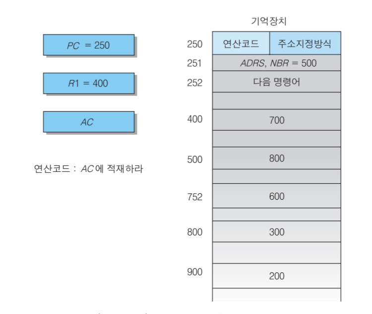

# 컴퓨터 명령어

참고 : [컴퓨터 구조](https://ridibooks.com/v2/Detail?id=2709000245)

- 컴퓨터 명령어는 컴퓨터가 수행해야하는 일을 나타내기 위한 비트들의 집합으로 일정한 형식을 가짐

- 컴퓨터는 명령어와 그것의 수행에 필요한 데이터가 주기억장치에 연속적으로 저장되어 있고, 이것을 중앙처리장치가 하나씩 순차적으로 수행, 제어장치는 기억장치에 저장된 명령과 데이터를 읽어 2진 코드를 해석한 후, 명령어의 수행을 위한 마이크로 연산이 이루어지는 데 필요한 제어신호를 제공

### 명령어의 구성

- 명령어는 필드라고 부르는 몇 개의 비트 그룹으로 나누어지며, 연산코드(operation code) 필드와 오퍼랜드(operand) 필드로 구성 됨
  - 연산코드 : 수행할 연산을 위한 명령어
  - 오퍼랜드 : 연산코드에서 결정된 명령을 수행할 대상이 되는 데이터 또는 데이터가 저장된 주소
- 명령어 기능
  - 함수연산기능 : 산술연산, 논리연산
  - 전달기능 : 레지스터들 사이의 정보전달, 중앙처리장치와 주기억장치 사이의 정보전달
  - 제어기능 : 조건 분기와 무조건 분기 등을 통해 명령어의 수행 순서 제어(분기, 스킵, 서브루틴 호출)
  - 입출력기능 : 주기억장치와 입출력장치 사이의 정보 이동

### 명령어 형식

- 오퍼랜드가 저장되는 곳
  - 스택, 누산기, 레지스터, 주기억장치의 주소
- 오펀랜드가 주소일 경우 오퍼랜드의 수에 따라 0-주소 명령어, 1-주소 명령어, 2-주소 명령어, 3-주소 명령어로 나뉨
- 명령어의 길이는 컴퓨터의 성능에 영향을 줌, 명령어의 길이가 길면 주기억 장치에 저장된 명령어를 인출 할 때 많은 수의 비트가 주기억장치와 중앙처리장치 사이에 이동되어야하므로 주기억장치 밴드 폭을 많이 사용하게 되어 비효율

#### 기억장소에 따른 명령어 형식

- 누산기를 이용한 명령어 형식
  - 누산기를 가진 컴퓨터 구조에서 누산기는 중앙처리장치 내에 있는 유일한 데이터 레지스터
  - 모든 연산은 누산기 레지스터를 대상으로 수행, 1-주소 명령어
  - ex) 
    - ADD X : AC <- AC + M[X]
    - LOAD X : AC <- M[X]
    - STORE X : M[X] <- AC
- 다중 레지스터를 이용한 명령어 형식
  - 2개 이상의 레지스터를 사용하여 연산 수행, 2-주소 명령어 또는 3-주소 명령어 사용
  - ex)
    - ADD R1, R2, R3 : R3 <- R1 + R2
    - ADD R1, R2 : R2 <- R1 + R2
    - MOVE R1, R2 : R2 <- R1
- 스택 구조를 이용한 명령어 형식
  - 0-주소 명령어
  - ex)
    - ADD : TOS <- TOS + TOS-1
    - PUSH X : TOS <- M[X]
    - POP X : M[X] <- TOS

### 주소지정방식

- 프로그램 수행 시 오퍼랜드를 지정하는 방법은 명령어 내에 있는 주소지정방식에 의해 결정 됨
- 주소지정방식이란 오퍼랜드를 실제로 참조하기 전에 명령어의 오퍼랜드를 변경하거나 해석하는 규칙을 지정하는 형식, 규칙의 적용에 의해 만들어진 오퍼랜드 주소를 유효주소라고 함

#### 의미주소지정(implied mode)

- 주소 필드가 필요 없는 방식, 묵시적인 의미(AC, 스택)로 오퍼랜드를 지정, 명령어의 종류가 제한 됨
- ex) 
  - MUL X : AC <- AC * M[X]
  - STORE X : M[X] <- AC

#### 즉치주소지정(immediate mode)

- 오퍼랜드 필드에 실제 데이터 저장, 속도가 빠르지만 데이터 크기가 오퍼랜드 필드의 비트수에 제한 됨
- ex) LDI 100, R1 : R1 <- 100

#### 직접주소지정(direct-addressing mode)

- 오퍼랜드 필드에 주소 저장, 기억장치에 한 번만 접근, 오퍼랜드 필드의 길이에 따라 접근 할 수 있는 기억장치의 주소공간에 한계
- ex) AC <- M[ADRS]

#### 간접주소지정(indirect-addressing mode)

- 오퍼랜드 필드에 유효주소가 저장되어 있는 기억장치주소를 저장, 기억장치로부터 주소를 가져온 후 주소 부분을 이용하여 다시 기억장치에 접근하여 유효주소를 읽음
- ex) AC <- M[M[ADRS]]

#### 레지스터 주소지정(register mode)

- 오퍼랜드 필드에 레지스터 번호를 저장, 레지스터에는 실제 사용할 데이터가 저장 
- 오퍼랜드 필드의 비트가 적어도 되며, 속도가 빠르나 레지스터의 수가 제한되어 있음

#### 레지스터 간접주소지정(register-indirect mode)

- 오퍼랜드 필드에 레지스터 번호를 저장하며, 레지스터에는 실제 오퍼랜드가 저장된 기억장치주소를 저장

#### 상대주소지정

- 유효 주소 = 오퍼랜드 필드 내용 + PC 내용
- 분기형 명령어에서 종종 사용

#### 인덱스된 주소지정

- 유효 주소 = 오퍼랜드 필드 내용 + 인덱스 레지스터의 내용
- 배열 인덱싱할 때 많이 사용

#### 요약

| 조수지정방식     | 기호표기     | 레지스터 전송    | 유효주소 | AC의 이용 |
| ---------------- | ------------ | ---------------- | -------- | --------- |
| 즉치주소         | LDA #NBR     | AC <- NBR        | 251      | 500       |
| 직접주소         | LDA ADRS     | AC <- M[ADRS]    | 500      | 800       |
| 간접주소         | LDA[ADRS]    | AC <- M[M[ADRS]] | 800      | 300       |
| 상대주소         | LDA $ADRS    | AC <- M[ADRS+PC] | 752      | 600       |
| 인덱스주소       | LDA ADRS(R1) | AC <- M[ADRS+R1] | 900      | 200       |
| 레지스터주소     | LDA R1       | AC <- R1         | -        | 400       |
| 레지스터간접주소 | LDA (R1)     | AC < M[R1]       | 400      | 800       |

### 명령어 종류

#### 데이터 전송 명령어

- LD, ST, MOVE, XCH, PUSH, POP, IN, OUT

#### 데이터 처리 명령어

- 산술 명령어
  - INC, DEC, ADD, SUB, MUL, DIV, ADDC, SUBB, NEG
- 논리 및 비트 처리 명령어
  - CLR, SET, COM, AND, OR, XOR, CLRC, SETC, COMC
- 시프트 명령어
  - SHR, SHL, SHRA, SHLA, ROR, ROL, RORC, ROLC

#### 프로그램 제어 명령어

- BR, JMP, SKP, CALL, RET, CMP, TEST

