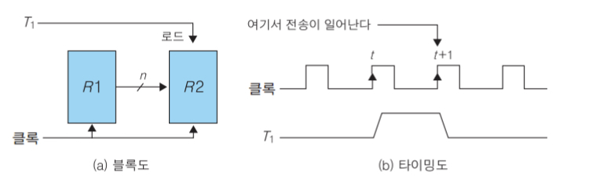
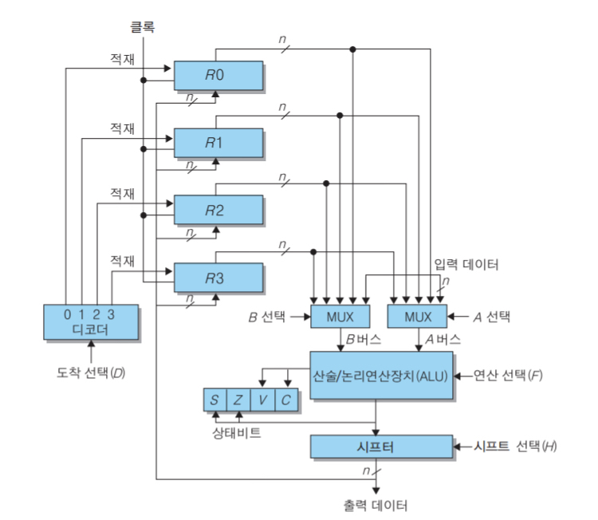
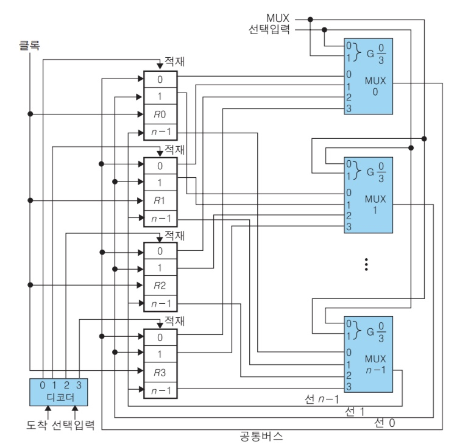
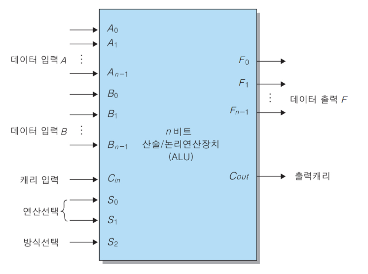
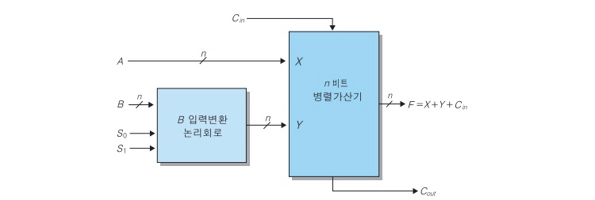
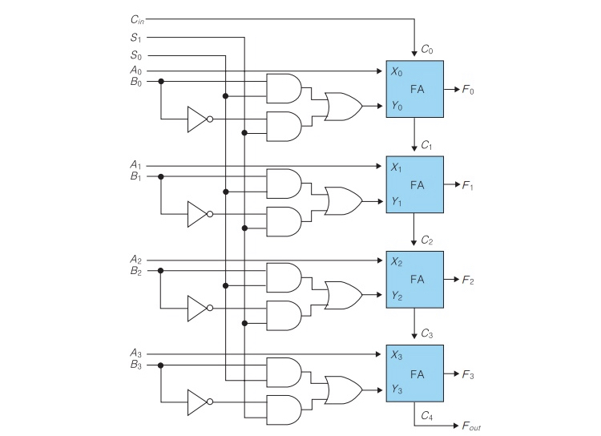
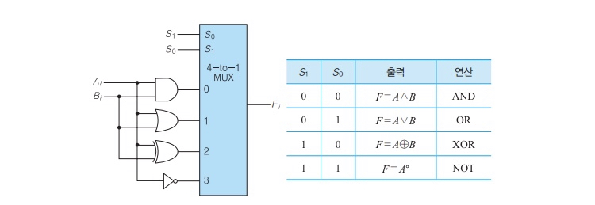
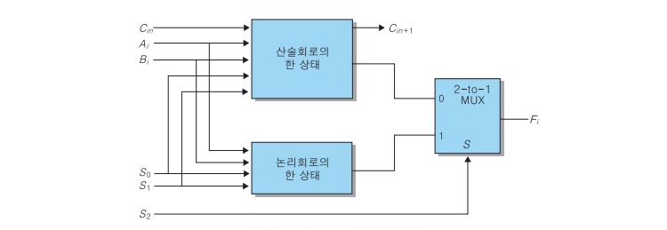
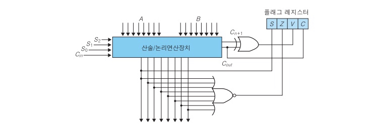
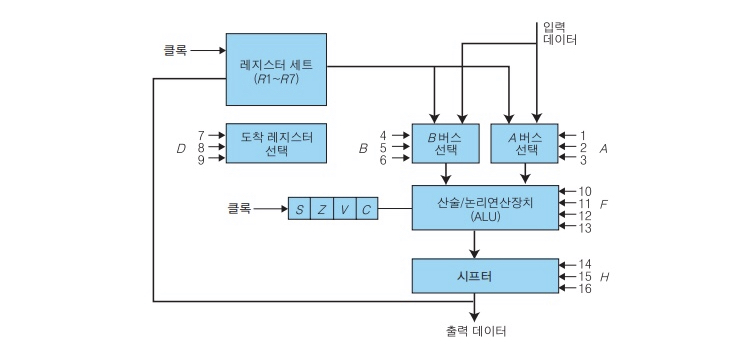

# 처리장치

참고 : [컴퓨터 구조](https://ridibooks.com/v2/Detail?id=2709000245)


- 처리장치 : 데이터를 처리하는 연산을 실행
- 제어장치 : 연산의 실행순서를 결정

- 제어신호 : 다양한 데이터 처리연산을 구동하는 2진 신호, 일련의 연산을 실행할 수 있도록 제어장치는 적절한 순서로 제어신호를 제공
- 상태신호 : 제어장치는 이후에 처리장치로부터 상태신호를 전송받음


### 마이크로 연산

- 레지스터나 기억장치에 저장되어 있는 데이터에 대해서 실행하는 기본적인 연산
- 레지스터 전송 마이크로 연산, 산술 마이크로연산, 논리 마이크로연산, 시프트 마이크로연산


#### 레지스터 전송 마이크로연산

- 레지스터는 입력신호에 의해 상태가 변할 때까지 현재의 2진 상태를 유지하는 논리소자인 플리플롭으로 구성 됨
- n비트 레지스터 내에 있는 각각의 플립플롭은 일반적으로 0부터 n-1까지의 순서대로 번호를 붙이며 최상의 비트의 위치로 가면서 그 위치값이 하나씩 증가. 0번 비트가 오른쪽에 있는 경우를 little-endian, 0번 비트가 왼쪽에 나타나는 경우를 big-endian이라고 함
- R2 ← R1
  - 레지스터들 사이에 데이터를 전송하는 마이크로연산은 연산자 ← 로 표시
  - R1의 내용이 레지스터 R2로 전송됨을 나타냄
  - R1을 출발 레지스터(source register), R2를 도착 레지스터(destinaion register)라고 함
  - 출발 레지스터의 내용은 전송에 의해 변하지 않으며 도착 레지스터의 내용이 변함
- 전송은 클록 펄스가 발생할 때마다 실행되지 않고 특정 제어신호가 가해질때만 실행
  - T1 : R2 ← R1
  - T1은 제어장치에서 발생시키는 제어신호, T1 = 1 일때만 해당 하드웨어에서 데이터 전송이 실행 됨
- 레지스터 전송이 가능하기 위해서는 출발 레지스터의 출력과 도착 레지스터의 입력이 회로로 연결되어 있어야 하며 도착 레지스터에는 주고받는 레지스터의 모든 비트가 한 클록신호 동안 동시에 전송되는 병렬 로드 기능이 있어야 함
- (a) R1에서 R2로의 전송을 나타냄, (b) R2의 내용이 R1으로 전송되는 것은 T1이 1에서 0으로 떨어지는 순간에 이루어짐



- 레지스터 전송문장에서 사용하는 기본기호

  | 기호                 | 의미                                           | 예                    |
  | -------------------- | ---------------------------------------------- | --------------------- |
  | 영문자 (숫자와 함께) | 레지스터를 표시                                | AR, R2, DR, IR        |
  | 괄호                 | 레지스터의 일부분                              | R2(1), R2(7:0), AR(L) |
  | 화살표               | 자료의 이동 표시                               | R1←R2                 |
  | 쉼표                 | 동시에 실행되는 2개 이상의 마이크로연산을 구분 | R1←R2, R2←R1          |
  | 대괄호               | 메모리에서의 어드레스                          | DR←M[AR]              |


#### 산술 마이크로연산

| 기호표시       | 의미                                   |
| -------------- | -------------------------------------- |
| R0←R1+R2       | R1과 R2의 합을 R0에 저장               |
| R2←R2보수      | R2의 보수(1의 보수)를 R2에 저장        |
| R2←R2보수+1    | R2에 2의 보수를 계산 후 저장           |
| R0←R1+R2보수+1 | R1에 R2의 2의 보수를 더한 후 R0에 저장 |
| R1←R1+1        | R1에 1 더함(상승 카운트)               |
| R1←R1-1        | R1에 1 뺌(하강 카운트)                 |

- 뺄셈은 보수연산과 가산으로 구성

- 곱셈, 나눗셈은 기본 마이크로연산을 적절히 결하하여 실행

#### 논리 마이크로연산

- 레지스터에 저장된 각 비트를 독립된 2진 값으로 취급

| 기호표시  | 의미                           |
| --------- | ------------------------------ |
| R0←R1보수 | 비트별 논리적 NOT(1의 보수)    |
| R0←R1∧R2  | 비트별 논리적 AND(비트 클리어) |
| R0←R1∨R2  | 비트별 논리적 OR(비트 세트)    |
| R0←R1⊕R2  | 비트별 논리적 XOR(비트별 보수) |


#### 시프트 마이크로연산

| 기호표시  | 의미          |
| --------- | ------------- |
| R1←shl R2 | 왼쪽 시프트   |
| R1←shr R2 | 오른쪽 시프트 |


### 처리장치의 구성요소



- 마이크로연산이 실행되기 위해서 지정된 출발 레지스터의 내용이 ALU의 입력으로 전달되고, ALU에서 그 연산을 실행한 후에 그 결과가 도착 레지스터에 전송
- 각 레지스터는 ALU와 연결된 버스를 통해 2개의 멀티플렉서와 연결, 각 멀티플렉서는 선택신호를 이용하여 특정 레지스터를 선택
- 2개의 멀티플렉서에 의해 선택된 데이터는 ALU에 의해 산술연산과 논리연산을 실행, ALU에 있는 선택신호에 의해 실행되어야 할 특정 마이크로연산이 선택 됨
- ALU에서 실행된 마이크로연산의 결과는 시프트 레지스터를 거치며 시프트 레지스터에서 선택신호는 특정 마이크로연산을 선택 할 수 있게하고, 그 결과는 연결된 버스를 통해 레지스터들의 입력으로 전달
- 디코더는 처리장치의 각 레지스터에 연결되어 있으며, 선택신호에 따라 도착 레지스터를 결정
- 도착 레지스터에는 지금까지 수행된 마이크로연산의 결과가 저장 됨
- ALU에서의 연산결과는 특수 레지스터인 상태 레지스터의 상태비트로 저장되며 CPU의 제어장치가 다음동작을 결정하는 데 사용 됨
- 상태비트
  - C : 캐리
  - V : 오버플로
  - S : 부호
  - Z : 제로


#### 내부버스

- 중앙처리장치 내부의 연산장치와 레지스터 사이의 정보 전송 경로
- 처리 장치 내부의 각 레지스터는 그 안에 저장된 정보를 입력버스를 통해 해당 목적지 레지스터로 전송하고 연산장치에서의 연산결과는 출력버스를 통해 해당 목적지 레지스터로 전송
- 내부버스는 멀티플렉서와 디코더로 구성, 멀티플렉서는 출발 레지스터를 선택하고 디코더는 버스로부터 정보를 받아들이는 도착 레지스터를 선택

- 멀티플렉서에 가해지는 선택입력은 어느 레지스터의 내용을 실을 것인가를 결정
- 디코더에 가해지는 도착 선택입력은 버스로부터 정보를 받을 레지스터를 결정
- ``` R2←R0```
  - 멀티플렉서 선택입력을 2진수 00으로 하여 레지스터 R0의 비트 0은 MUX 0을 통해 버스선 0으로 연결하고, R0의 비트 1은 MUX 1을 통해 버스선 1에 연결되도록 함, 나머지 비트도 멀티플렉서를 통해 해당 버스선으로 연결, 멀티플렉서 선택이 00일 때 레지스터 R0의 n비트 정보를 공통버스선에 싣도록 함
  - 도착 레지스터를 선택하기 위해 디코더의 도착 선택입력을 2진수 10으로 하여, R2 적재입력을 구동시키는 디코더의 출력 2를 활동상태로 만듦
  - 클록 천이 시에 공통 버스 위에 실려 있는 R0의 내용을 R2로 적재

#### 산술/논리연산장치



- A에서 n개의 데이터와 B에서 n개의 데이터가 입력되어 그 결과가 F의 출력
- S2 : 산술연산과 논리연산 구분
- S1, S0 : 실행할 산술연산 혹은 논리연산을 지정
- 입력캐리, 출력캐리는 산술연산 시에만 사용

##### 산술연산회로

- 가장 기본적인 구성요소는 병렬가산기

  

- 산술연산회로에 대한 연산표

| 선택신호 S1 | 선택신호 S0 | 입력값 Y | Cin=0       | Cin=1          |
| ----------- | ----------- | -------- | ----------- | -------------- |
| 0           | 0           | 모두 0   | F=A(전송)   | F=A+1(증가)    |
| 0           | 1           | B        | F=A+B(가산) | F=A+B+1        |
| 1           | 0           | ~B       | F=A+~B      | F=A+~B+1(감산) |
| 1           | 1           | 모두 1   | F=A-1(감소) | F=A(전송)      |

- 4비트 산술연산회로도

  

##### 논리회로



##### 산술/논리연산장치

- 산술연산회로와 논리연산회를 결합한 ALU



- 제3의 선택변수를 사용하여 산술연산과 논리연산 구분


#### 상태 레지스터



- Carry bit : 두 수 가산하여 캐리 발생 시 1로 세트, 감산에서 자리내림이 발생했을때도 1로 세트
- Zero bit : 두 수를 연한한 후 결과값이 0이면 1로 세트
- Sign bit : 최상위 비트가 0이면 양수, 1이면 음수
- Overflow bit : 오버플로는 두 수를 가산할 때 결과를 저장할 수 있는 레지스터의 자릿수가 모자랄 때 발생하는 에러로서, 오버플로가 발생하면 오버플로 비트가 1로 세트


#### 시프터


- ALU는 데이터를 비트 단위로 이동시키는 시프트 기능이 없기때문에 ALU 출력 단에 시프터를 연결하여 시프트 연산을 수행

| H1   | H0   | 연산    | 기능                     |
| ---- | ---- | ------- | ------------------------ |
| 0    | 0    | S←F     | 시프트 없이 전송         |
| 0    | 1    | S←shr F | 오른쪽 시프트하여 전송   |
| 1    | 0    | S←shl F | 왼쪽 시프트하여 전송     |
| 1    | 1    | S←0     | 모든 출력비트에 0을 전송 |


#### 제어단어



- 처리장치의 각 구성요소에는 선택신호가 입력되며, 이 선택신호가 처리장치의 버스, ALU, 시프터, 도착 레지스터 등을 제어