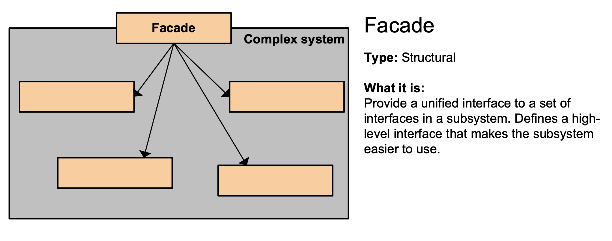

# 퍼사드

### 의도
한 서브시스템 내의 인터페이스 집합에 대한 획일화된 하나의 인터페이스를 제공하는 패턴으로, 서브시스템을 사용하기 쉽도록 고수준의 인터페이스를 정의

### 동기
- 시스템을 서브시스템으로 구조화하면 복잡성을 줄일 수 있음
- 서브시스템들 사이의 의사소통 및 종속성을 최소화하는 것이 공통적인 설계 목표
- 주어진 서브시스템의 일반적인 기능에 대한 단순화된 하나의 인터페이스를 제공

### 활용성
- 복잡한 서브시스템에 대한 단순한 인터페이스 제공 필요
- 추상 개념에 대한 구현 클래스와 사용자 사이에 너무 많은 종속성이 존재 할 때 퍼사드를 사용해 사용자와 다른 서브시스템 간의 결합도를 줄임
- 각 서브시스템의 계층에 대한 접근점 제공하여 퍼사드를 통해서만 대화를 진행하게 함으로써 서브시스템간의 종속성을 줄임

### 참여자
- 퍼사드 : 단순하고 일관된 통합 인터페이스를 제공하며, 서브시스템을 구성하는 어떤 클래스가 어떤 요청을 처리해야 하는지 알고 있으며, 사용자의 요청을 해당 서브시스템 객체에 전달
- 서브시스템 클래스들 : 서브시스템의 기능을 구현하고, 퍼사드 객체로 할당된 작업을 실제로 처리하지만 퍼사드에 대해서는 참조하지 않음

### 협력방법
- 사용자는 퍼사드에 정의된 인터페이스를 이용해서 서브시스템과 상호작용 함. 또, 퍼사드는 해당 요청을 서브시스템을 구성하는 적당한 객체에게 전달
- 퍼사드를 사용하는 사용자는 서브시스템을 구성하는 객체로 직접 접근하지 않아도 됨

### 결과
- 서브시스템의 구성요소 보호
- 서브시스템과 사용자 코드간의 결합도를 더욱 약하게 함, 서브시스템 내 정의된 요소들은 강하게 결합
- 응용프로그램 쪽에서 서브시스템 클래스를 사용하는 것을 완전히 막지 않기때문에 퍼사드를 사용할지 서브시스템을 사용할지 결정할 수 있음

### 구현시 고려할 사항
- 사용자와 서브시스템 간의 결합도 줄이기
- 서브시스템 클래스 중 공개할 것과 감출 것

### 관련 패턴
- 추상 팩토리(Abstract Factory) 패턴
  - 서브시스템 객체를 생성하는 인터페이스를 제공하기 위해 퍼사드와 함께 사용할 수 있음
- 중재자(Mediator) 패턴
  - 기존에 존재하는 클래스의 기능성을 추상화한다는 점에서 퍼사드 패턴과 비슷하며 중재자 패턴의 목적은 여러 객체들 사이의 협력 관계를 추상화 하여 기능성의 집중화를 막음
  - 중재자 패턴에 참여하는 객체는 서로를 직접 알지 못하고 단지 중재자를 통해서만 상호작용 함, 퍼사드는 서브시스템 인터페이스 자체를 추상화하여 사용을 용이하게 함