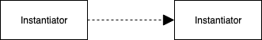
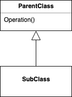
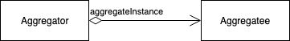

# Introduction

### 디자인 패턴을 이용하여 문제를 푸는 방법

#### 적당한 객체 찾기

- 객체 = 데이터 + 데이터에 연산을 가하는 프로시저(메서드 or 연산)

- 객체는 요청 또는 메시지를 사용자에게 받으면 연산을 수행

- 요청은 객체가 연산을 실행하게 하는 유일한 방법이고, 연산은 객체의 내부 데이터의 상태를 변경하는 유일한 방법
- 접근의 제약 사항으로 객체의 내부 상태를 캡슐화
- 고려사항 : 캡슐화, 크기, 종속성, 유연성, 성능, 진화, 재사용성

#### 객체의 크기 결정

#### 객체 인터페이스의 명세

- 인터페이스
  - 객체가 정의하는 연산의 모든 시그너처(연산의 이름, 매개변수, 연산의 반환 값)들을 일컫는 말로 객체의 인터페이스는 객체가 받아서 처리할 수 있는 연산의 집합
- 타입
  - 특정 인터페이스를 나타낼 때 사용하는 이름
  - 객체가 Window 타입을 갖는다는 것은 Window 인터페이스에 정의한 연산들을 모두 처리할 수 있다는 것을 의미
- 객체는 인터페이스로 자신을 드러냄, 구현에 대해서는 전혀 알려주지 않으며 서로 다른 객체는 동일한 인터페이스라도 구현 방법을 자유롭게 선택할 수 있음
- 런타임에 요청과 요청을 처리할 객체를 연결 짓는 것을 동적 바인딩 이라고 함
- 동적 바인딩은 프로그램이 기대하는 객체를 동일한 인터페이스를 갖는 다른 객체로 대체할 수 있게 해줌, 이런 대체성을 다형성이라고 함
- 다형성은 사용자의 정의를 단순화하고 객체 간의 결합도를 없애며 프로그램 실행 중에는 서로 간의 고나련성을 다양화할 수 있게 해 줌

#### 객체 구현 명세하기

- 어떤 객체의 구현은 클래스에서 정의, 클래스는 객체의 내부 데이터와 표현 방법을 명세하고, 그 객체가 수행할 연산을 정의

- 객체는 클래스를 인스턴스로 만듦으로써 생성. 즉 객체는 클래스의 인스턴스

- 클래스의 인스턴스의 과정은 객체의 내부 데이터(인스턴스변수)에 대한 공간을 할당하고, 이 데이터들을 연산과 관련짓는 것

- 인스턴스화

  

- 클래스 상속

  

- 클래스 상속 대 인터페이스 상속
  - **클래스**는 객체의 내부 상태와 그 객체의 연산에 대한 구현 방법을 정의
  - 객체의 **타입**은 그 객체의 인터페이스, 즉 그 객체가 응답할 수 있는 요청의 집합을 정의
  - 객체의 구현은 다를지라도 인터페이스는 같을 수 있음
  - 클래스도 객체가 수행할 수 있는 연산을 정의하므로, 객체의 타입을 정의하는 것임. 어떤 객체가 어떤 클래스의 인스턴스라고 말할 때, 그 객체는 그 클래스가 정의한 인터페이스를 지원한다는 뜻이 숨어있음
  - 클래스 상속은 객체의 구현을 정의할 때 이미 정의된 객체의 구현을 바탕으로 함. 코드와 내부 표현 구조를 공유하는 메커니즘
  - 인터페이스 상속(서브타이핑)은 어떤 객체가 다른 객체 대신에 사용될 수 있는 경우를 지정하는 메커니즘. 인터페이스 상속 관계가 있다면 프로그램에는 슈퍼타입으로 정의하지만 런타임에 서브타입의 객체로 대체할 수 있음
- 구현에 따르지 않고, 인터페이스에 따르는 프로그래밍
  - 추상 클래스를 정의하고 인터페이스 개념으로 객체를 다룰 때 장점
    - 사용자가 원하는 인터페이스를 그 객체가 만족하고 있는 한, 사용자는 그들이 사용하는 특정 객체 타입에 대해 알아야 할 필요는 없음
    - 사용자는 이 객체들을 구현하는 클래스를 알 필요가 없고, 단지 인터페이스를 정의하는 추상 클래스가 무엇인지만 알면 됨
  - 이렇게 하면 서브시스템 간의 구현 종속성이 없어짐
  - **구현이 아닌 인터페이스에 따라 프로그래밍 하라**

#### 재사용을 실현 가능한 것으로

- 상속 대 합성
  - 객체지향 시스템에서 기능의 재사용을 위해 구사하는 가장 대표적인 기법은 클래스 상속(서브클래싱), 그리고 객체 합성
  - 서브클래싱에 의한 재사용은 **화이트박스 재사용**
  - 객체 합성은 클래스 상속에 대한 대안으로 다른 객체를 여러 개 붙여서 새로운 기능 혹은 객체를 구성
  - 객체를 합성하기 위해서는 합성에 들어가는 객체들의 인터페이스를 명확하게 정의해야 함, 객체의 내부는 공개되지 않고 인터페이스를 통해서만 재사용되기 때문에 **블랙박스 재사용**
  - 클래스 상속의 단점
    - 런타임에 상속받은 부모 클래스의 구현을 변경 할 수 없음. 상속은 컴파일 시점에 결정 됨
    - 부모 클래스의 구현에 종속
  - 객체 합성은 한 객체가 다른 객체에 대한 참조자를 얻는 방식으로 런타임에 동적으로 정의
  - **객체 합성이 클래스 합성보다 더 나은 방법이다**
- 위임
  - 두 객체가 하나의 요청을 처리
  - 수신 객체가 연산의 처리를 위임자에게 보냄
  - 장점 : 런타임에 행동의 복합을 가능하게 하고, 복합하는 방식도 변경해 줌
  - 단점 : 구조 이해의 어려움
- 상속 대 매개변수화된 타입(제네릭)

#### 런타임 및 컴파일 타임의 구조를 관계짓기

- 집합(aggregation), 포함(having), 부분(part of)
  - 한 객체가 다른 객체를 소유하거나 그것에 책임 진다는 뜻, 생존 주기가 같음
- 인지(acquaintance), 연관(association), 사용(using)
  - 한 객체가 다른 객체에 대해 알고 있음
  - 인지를 받는 객체는 서로의 연산을 요청할 수도 있지만 서로에 대해 책임은 지지 않음
- 실선은 인지 관계, 다이아몬드를 갖는 실선 화살표는 집합 관계를 의미

- 집합 관계와 인지 관계는 쉽게 구분하기가 까다로움, 언어의 처리 방식이 아닌 사용 목적에 따라 결정해야 함
- 집합 관계는 인지 관계보다는 강력한 영속성의 개념을 갖음
  - 집합관계 : 자전거 - 바퀴
  - 인지관계 : 사람 - 회사

